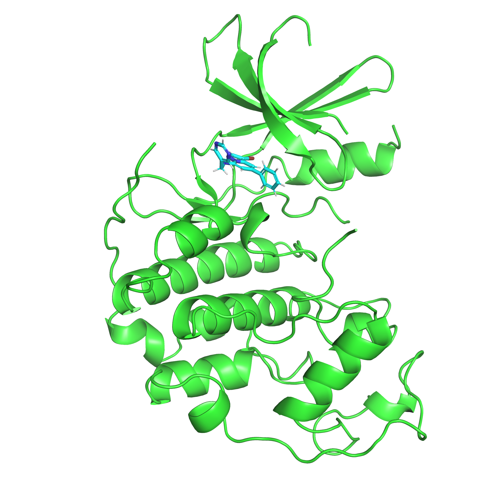
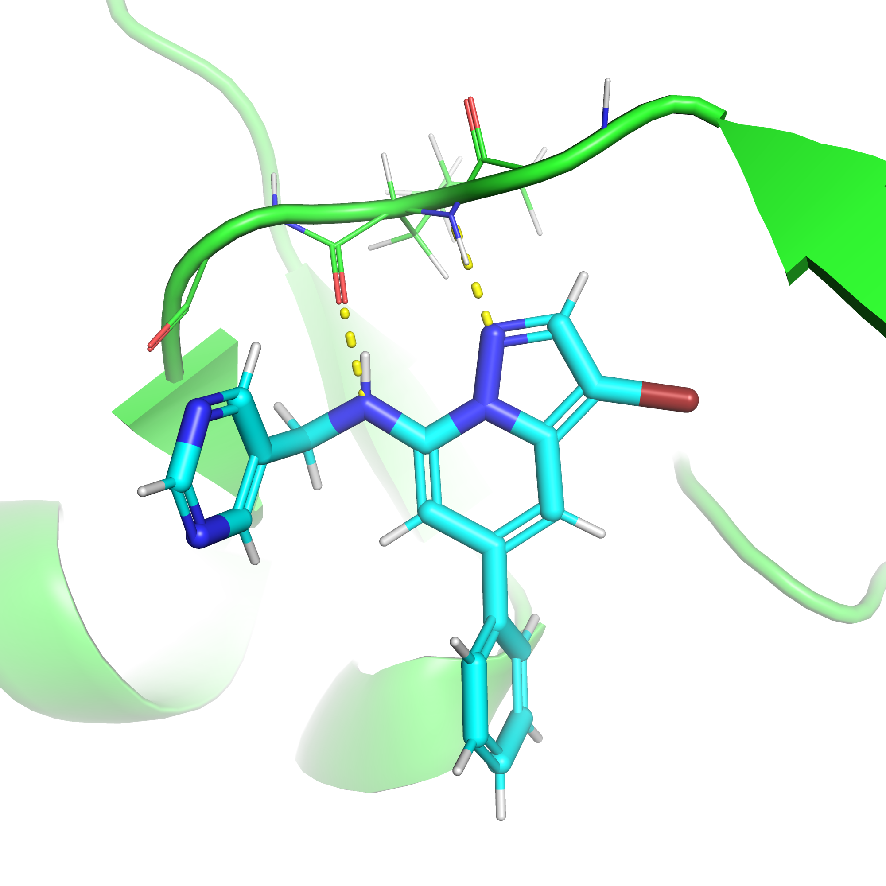
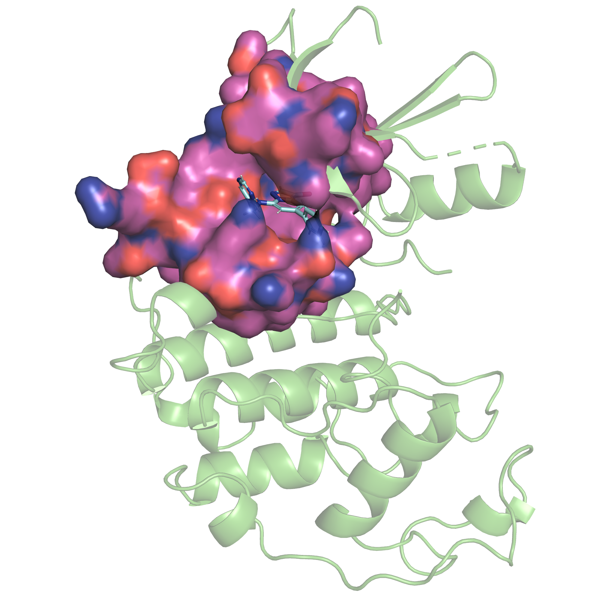
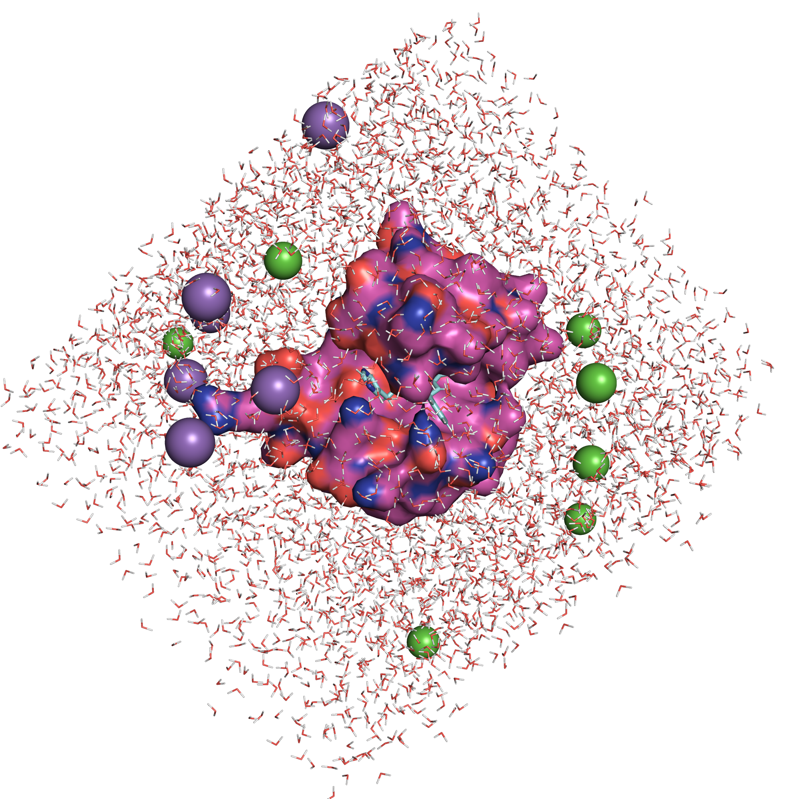

# Welcome to the Openduck tutorial

Openduck is an opensource version of Dynamic Undocking, a particular implementation of steered molecular dynamics ment to assess the robustness of protein-ligand complexes through the work needed to bring the main hydrogen bond interaction to the quasi-bound state.

## Getting started

### Installing openduck
To get started, we will install openduck on an anaconda environment (you can do it in whichever python environment you prefer).

```{bash}
$ git clone git@github.com:CBDD/openduck.git
$ cd openduck
$ conda env create -f environment.yaml
$ conda activate openduck
$ python setup.py install
$ cd ..
```

### Downloading the tutorial data

Once we have openduck up and running, we can start the tutorial by getting the necessary files to run it (including this file).

```{bash}
$ git clone git@github.com:AlvaroSmorras/openduck-tutorial.git
$ cd openduck-tutorial
```
To run Dynamic Undocking we only need a protein receptor and one or more ligands. In these tutorials, we will use ligands and proteins available in the pdb and configuration files in yaml format.

## System preparation

In this tutorial we will work with the Cyclin Dependant Kinase 2 (CDK2) and an inhibitor (SCQ), both from the [2R3K](https://www.ebi.ac.uk/pdbe/entry/pdb/2r3k) structure from the PDB. As seen in the image below, the kinase inhibitor is in a region called the 'hinge', between the beta-sheets and alpha-helixes domains. The inhibitor is interacting with the hinge loop through two hydrogen bonds (HB). Both HB are being performed with the leucine 83 backbone. Through the tutorial we will learn how to prepare and launch Dynamic Undocking to obtain the $W_{QB}$ of the inhibitor SCQ bound to CDK2.  

<p float='middle'>


</p>


### 1 Chunking

Dynamic Undocking's main descriptor, the quasi-bond work ($W_{QB}$), is a local measurement of the stability of the protein-ligand complex. This lets us reduce the receptor to the minimum residues to preserve the ligand's environment and to quicken the simulations. This proces we call chunking.

Chunking is integrated in all of the openduck preparation ( openMM-full-protocol, openMM-prepare and amber-prepare ) however, it also has a standalone subcommand. While chunking can be done within the pipeline, we recommend doing separatedly beforehand in order to check the chunk representation of the receptor and to ensure it is the most appropiate.

An *adecuated chunk* has to fulfill the following conditions:

    - All residues directly interacting with the ligand
    - No artificial gaps in the pocket close to the hydrogen bond (water shielding is one of the most important ligands have on $W_{QB}$)
    - Available ligand exit pathway (only relevant for enclosed pockets)

We will use one of the two HB between the ligand and receptor mentioned above to create the chunk around. The tutorial has been set to employ configuration files (.yaml), however, a more *classical* flag-based execution is also possible. You can find template input yamls for every subprocess in the openduck files
To create the receptor chunk we only need the receptor and ligand files, the desired interaction we will use to launch DUck and a cutoff radius.

In our case, everything is specified in the configuration file *chunk_input.yaml*

``` {yaml}
# chunk_input.yaml
# Main arguments
interaction : A_LEU_83_N
receptor_pdb : 2r3k_receptor.pdb
ligand_mol : 2r3k_lig.mol
output : 2r3k_chunk.pdb

# Chunking arguments
cutoff : 11
ignore_buffers : False
```

To launch it, we need to activate the openduck conda environment, enter the directory and execute the chunking protocol we specified in the yaml.
```
$ conda activate openduck
$ cd 1_Chunking
$ openduck chunk -y chunk_input.yaml
```

You can open the chunked receptor with your prefered visualization program to check if it has the conditions we mentioned above. As the receptor is being 'cut' to reduce the atoms, each segment needs to be capped. Check that all the segments are properly capped in the resulting receptor.
If the receptor does not fulfil the conditions of an *adecuated chunk*, you can adjust the cutoff threshold at will.

<p float='middle'>

</p>

## 2 [Parametrization]

Now that we have a chunk we can proceed to parametrize the ligand, chunk and solvation. In the openduck executable this step is separated depending on the executable one wants to use afterwards, either Amber or openMM. However, the parametrization is done equally in both executions. Both *openmm-prepare* and *amber-prepare* have incorporated the chunking step, where you can use the appropiate parameters found during the previous step. Alternatively you can use the already chunked receptor but, remember checking the new interaction definition as during the chunking, the receptor residues might change numbering.

For the preparation we have a plethora of options regarding forcefields, the periodic box parameters and other execution options such as hydrogen mass repartitioning (HMR). To know more about the options you can run the *openduck amber-prepare* or the *openduck openmm-prepare* with the help flag.

The preparation has the following configuration file:
```
# amber-prepare input.yaml

# Main arguments
interaction : _LEU_31_N
receptor_pdb : 2r3k_chunk.pdb
ligand_mol : 2r3k_lig.mol

# Chunk
do_chunk : False

# Preparation
small_molecule_forcefield : gaff2
protein_forcefield : amber14-all
water_model : TIP3P
ionic_strength : 0.1
solvent_buffer_distance : 10
HMR : True

# Production arguments for amber queue and inputs
smd_cycles : 10
wqb_threshold : 6
queue_template : Slurm
```

We have chosen to prepare the solvation box with TIP3P waters, in a square box with 10A of buffer distance between the limits of the protein and the end of the box and a ionic strength of 0.1M. The chunk and ligand will be parametrized using the amber14SB and GAFF2 respectively. 
As we are going to use Amber for the DUck execution we will need to specify additional parameters. *Smd_cycles* defines the amount of iterations will the protocol run for, iterations resulting in a $W_{QB}$ lower than *Wqb_threshold* will halt the execution. *HMR* will be performed on the topology to allow a 4 fs timestep. Finally, a *slurm* queue file with the DUck commands for amber is generated. You can define new templates in the openduck files for your HPC facilities, if none (or *local*) is specified, the DUck protocol in amber will be writen into a bash script for local execution.

```
cd 2_Parametrization
openduck amber-prepare -y amber-prep_input_single_mol.yaml
```

We now have the directory filled with different files, from the amber input files (\*.in, dist_duck.rst & dist_md.rst), the topology & initial coordinates (HMR_system_complex.prmtop & system_complex.inpcrd) to the queue file (*duck_queue.q*). This will be all the necessary files to launch the production,but first lets have a look at the solvated system we will simulate. 

<p float='middle'>

</p>

### 2a Parametrizing Multiple ligands

DUck was initially designed as a post-docking filter for high-througput virtual screening (HTVS) campaigns. As such, the single protein-ligand parametrization explained in the [#parametrization] 

## Production